<h2>TensorFlow-FlexUNet-Image-Segmentation-Aerial-Imagery-Solar-Panel (2025/11/16)</h2>

Toshiyuki Arai 
Software Laboratory antillia.com 
 
This is the first experiment of Image Segmentation for <b>Aerial Imagery Solar-Panel</b> (Singleclass)  based on 
our <a href="./src/TensorFlowFlexUNet.py">TensorFlowFlexUNet</a>
 (<b>TensorFlow Flexible UNet Image Segmentation Model for Multiclass</b>)
, and a 572x572  pixels 
<a href="https://drive.google.com/file/d/1f_U3eHCRxKoVGGtZHjmYyd9ZXteOVHxR/view?usp=sharing">
<b>Augmented-Solar-Panel-ImageMask-Dataset.zip</b></a>
which was derived by us from 
<a href="https://gisstar.gsi.go.jp/gsi-dataset/02/H1-No20-572.zip">H1-No20-572.zip
</a> in Japanese web site <a href="https://gisstar.gsi.go.jp/gsi-dataset/27/index.html">GSI Dataset-27 (Solar Power Generation Facilities).</a>  
<b>Data Augmentation Strategy</b> 
To address the limited size of <b>GSI Dataset-27 (Solar Power Generation Facilities)</b>, which contains 679 images and overlay-masks respectively,
we used our offline augmentation tool <a href="https://github.com/sarah-antillia/ImageMask-Dataset-Offline-Augmentation-Tool"> 
ImageMask-Dataset-Offline-Augmentation-Tool</a>
and
<a href="https://github.com/sarah-antillia/Barrel-Image-Distortion-Tool">Barrel-Image-Distortion-Tool</a> 
 to augment the original dataset.
  

<b>Actual Image Segmentation for Images of  572 x 572 pixels</b> 
As shown below, the inferred masks predicted by our segmentation model trained on the 
Augmented dataset appear similar to the ground truth masks, but they lack precision in certain areas. 
Especially, on the third example, the dark areas of the Solar Panel's ground truth that are covered by the shadow of another objects are classified as a different category region at the pixel level segmentation, and therefore, such shadowed areas cannot be determined as part of the Solar Panel's region.
 
<table>
<tr>
<th>Input: image</th>
<th>Mask (ground_truth)</th>
<th>Prediction: inferred_mask</th>
</tr>
<tr>
<td>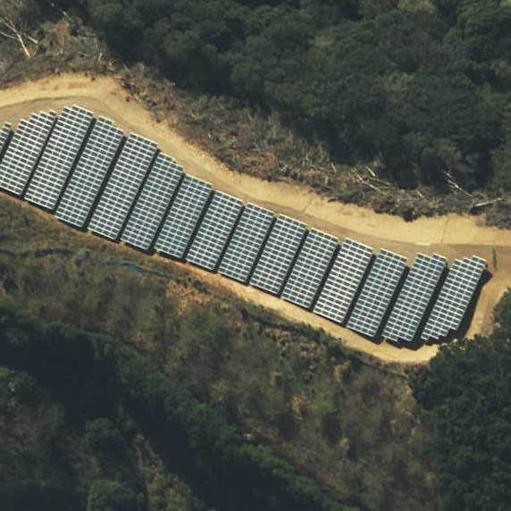</td>
<td>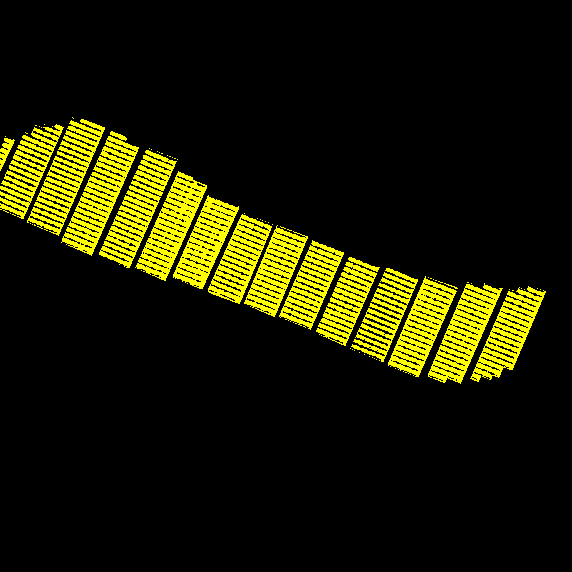</td>
<td>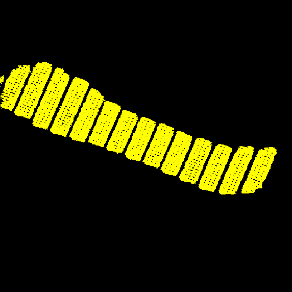</td>
</tr>

</tr>
<td>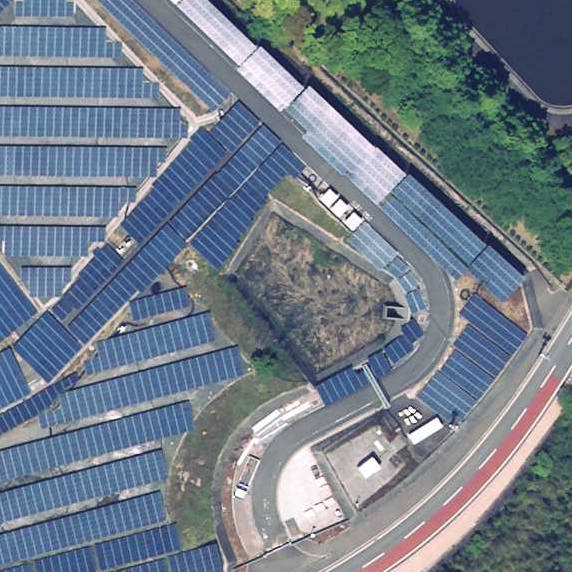</td>
<td>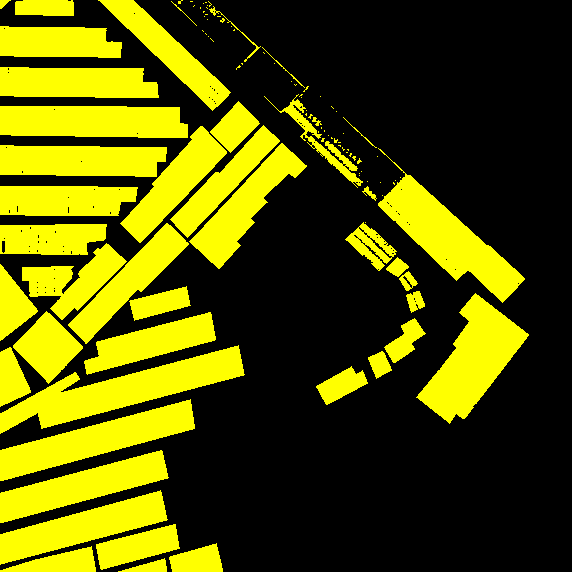</td>
<td></td>
</tr>
<tr>
<td>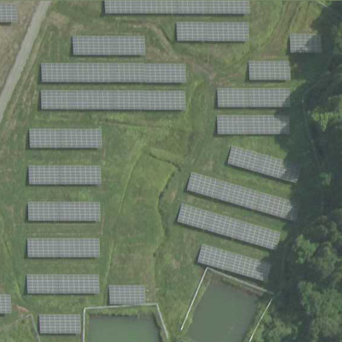</td>
<td></td>
<td>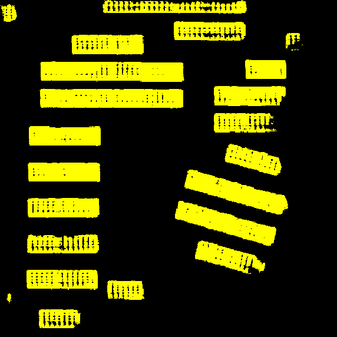</td>
</tr>
</table>

 
<h3>
1 Dataset Citation
</h3>
The dataset used here was derived from 

<a href="https://gisstar.gsi.go.jp/gsi-dataset/02/H1-No20-572.zip">H1-No20-572.zip
</a> in  Japanese web site <a href="https://gisstar.gsi.go.jp/gsi-dataset/27/index.html">GSI Dataset-27 (Solar Power Generation Facilities).</a>
  For simplicity, we used "Solar Panel" instead of "Solar Power Generation Facilities" in this experiment.
  
Please see also English page  
<a href="https://www.gsi.go.jp/ENGLISH/index.html">
GSI: Geospatial Information Authority of Japan
</a>
 
 
<b>GSI Dataset-27 (Solar Power Generation Facilities)</b> 
<b>Overview</b> 
This data is intended for use in machine learning, and is an 8-bit, 3-channel image of an aerial 
photograph taken with a ground pixel size of 20 cm, with pixels showing solar power generation facilities 
(large solar panels such as those installed in so-called mega solar power plants) labeled in yellow (RGB:#FFFF00).  
For use in machine learning, each piece of data consists of two pairs: the original image and the labeled image,  
and each pair can be identified by its file name. 
 
<b>Image specifications</b> 
Image sizes are available in two sizes: 572 x 572 pixels and 286 x 286 pixels. Both images have a bit depth of 8 bits per channel
and are in PNG format. 
As of November 10, 2022, there are 680 pairs of 572 x 572 pixel images and 3,400 pairs of 286 x 286 pixel images available 
for download.
 
 
<b>Source</b> 
 This data can be used under <a href="https://www.gsi.go.jp/ENGLISH/page_e30286.html">
 Geospatial Information Authority of Japan (GSI) Website Terms of Use</a>.  
 If you use it in a research presentation, etc., please indicate the source as follows: 
<b>
Geospatial Information Authority of Japan (2022):  
Training image data for extracting solar power generation facilities using CNN, Geospatial Information Authority of Japan Technical Document H1-No. 20.</b>
 
 
<b>License</b> 
<a href="https://www.digital.go.jp/en/resources/open_data/public_data_license_v1.0">
Public Data License (Version 1.0)
</a>
 
 
<h3>
2 Solar-Panel ImageMask Dataset
</h3>
 If you would like to train this Solar-Panel Segmentation model by yourself,
 please download <a href="https://drive.google.com/file/d/1f_U3eHCRxKoVGGtZHjmYyd9ZXteOVHxR/view?usp=sharing">
 <b>Augmented-Solar-Panel-ImageMask-Dataset.zip </b></a>
on the google drive, expand the downloaded, and put it under dataset folder to be:
<pre>
./dataset
└─Solar-Panel
    ├─test
    │  ├─images
    │  └─masks
    ├─train
    │  ├─images
    │  └─masks
    └─valid
        ├─images
        └─masks
</pre>
<b>Solar-Panel Statistics</b> 
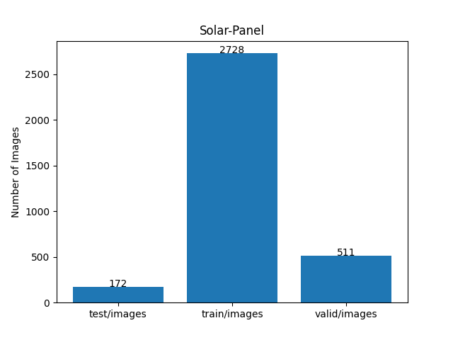 
 
As shown above, the number of images of train and valid datasets is large enough to use for a training set of our segmentation model.
  
In our dataset, each colorized mask  was generated by subtracting a raw image from the corresponding
 mask overlay, and colorizing the subtracted image with yellow, as shown below.
 
<table>
<tr>
<th>mask overlay</th><th>raw image</th><th>colorized masks</th>
</tr>
<tr>

<td>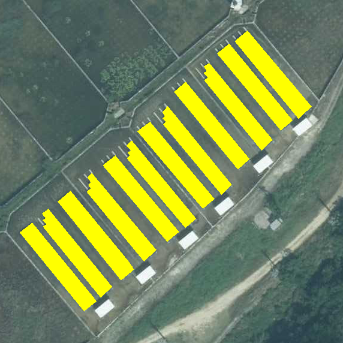</td>
<td></td>
<td></td>
</tr>
<tr>

<td>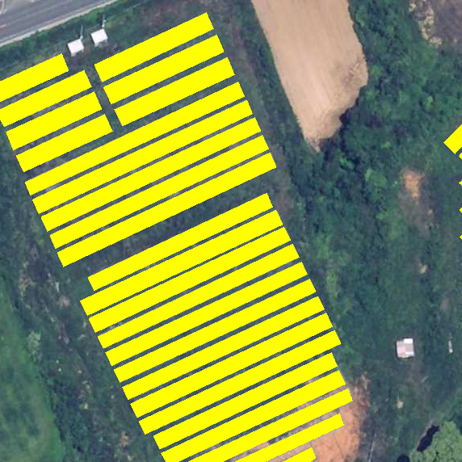</td>
<td>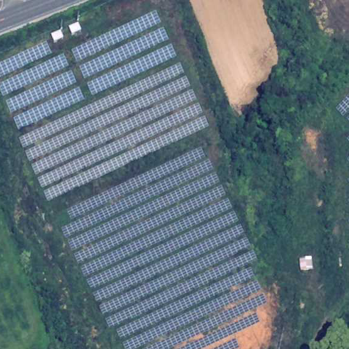</td>
<td>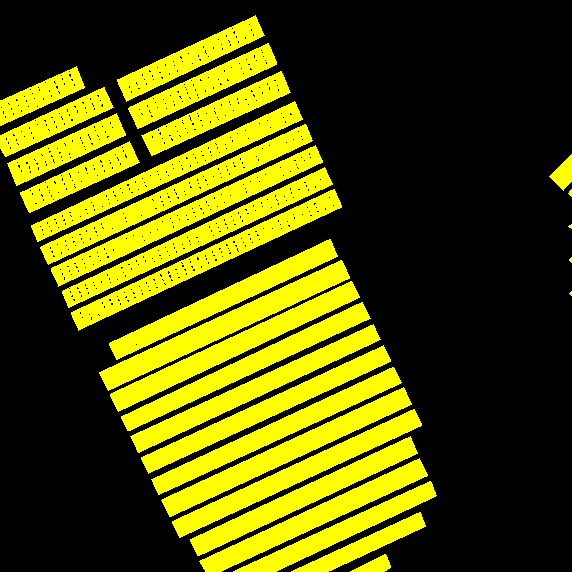</td>
</tr>

<td>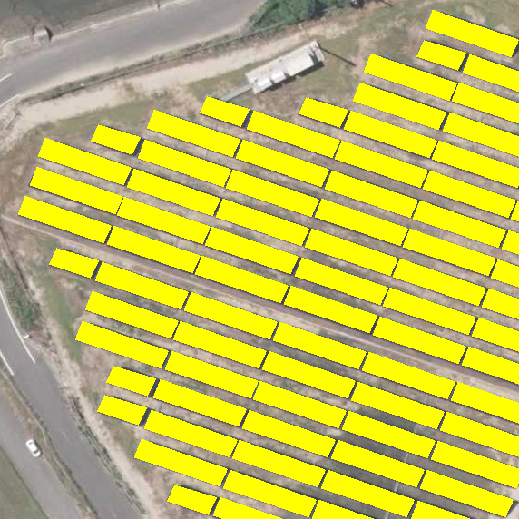</td>
<td>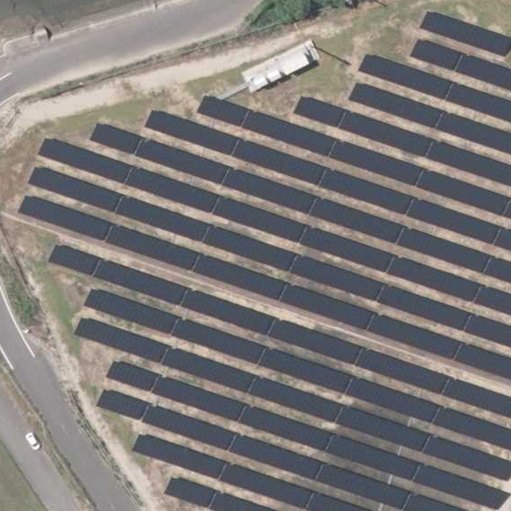</td>
<td>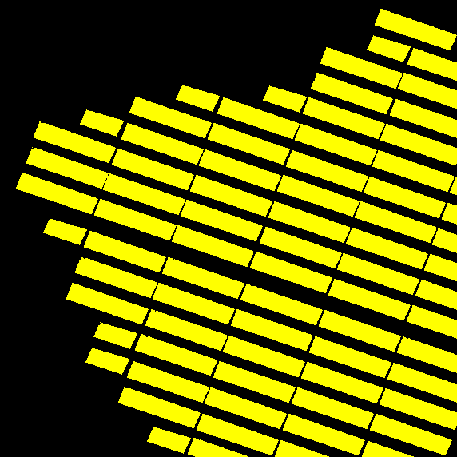</td>
</tr>
</table>

  
<b>Train_images_sample</b> 
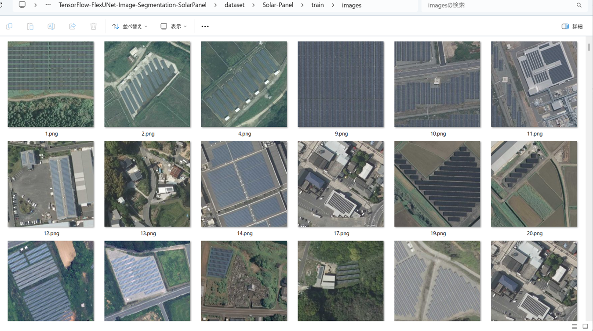
 
<b>Train_masks_sample</b> 
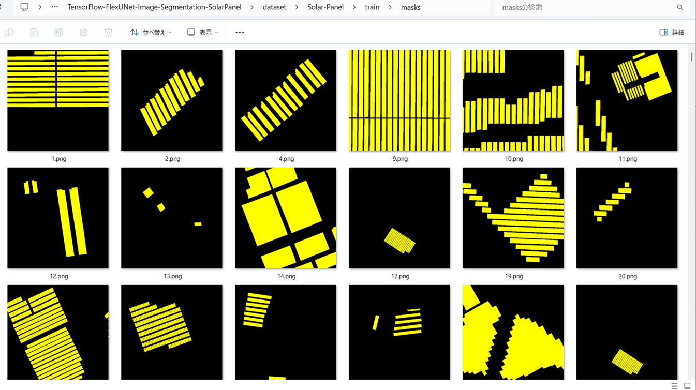
 
 
<h3>
3 Train TensorFlowUNet Model
</h3>
 We trained Solar-Panel TensorFlowFlexUNet Model by using the following
<a href="./projects/TensorFlowFlexUNet/Solar-Panel/train_eval_infer.config"> <b>train_eval_infer.config</b></a> file.  
Please move to ./projects/TensorFlowFlexUNet/Solar-Panel, and run the following bat file. 
<pre>
>1.train.bat
</pre>
, which simply runs the following command. 
<pre>
>python ../../../src/TensorFlowFlexUNetTrainer.py ./train_eval_infer.config
</pre>

<b>Model parameters</b> 
Defined a small <b>base_filters = 16</b> and large <b>base_kernels = (7,7)</b> for the first Conv Layer of Encoder Block of 
<a href="./src/TensorFlowFlexUNet.py">TensorFlowFlexUNet.py</a> 
and a large num_layers (including a bridge between Encoder and Decoder Blocks).
<pre>
[model]
image_width    = 512
image_height   = 512
image_channels = 3

num_classes    = 2

base_filters   = 16
base_kernels   = (7,7)
num_layers     = 8
dropout_rate   = 0.04
dilation       = (1,1)
</pre>

<b>Learning rate</b> 
Defined a very small learning rate.  
<pre>
[model]
learning_rate  = 0.00007
</pre>

<b>Online augmentation</b> 
Disabled our online augmentation.  
<pre>
[model]
model         = "TensorFlowFlexUNet"
generator     = False
</pre>

<b>Loss and metrics functions</b> 
Specified "categorical_crossentropy" and <a href="./src/dice_coef_multiclass.py">"dice_coef_multiclass"</a>. 
You may specify other loss and metrics function names. 
<pre>
[model]
loss           = "categorical_crossentropy"
metrics        = ["dice_coef_multiclass"]
</pre>
<b>Learning rate reducer callback</b> 
Enabled learing_rate_reducer callback, and a small reducer_patience.
<pre> 
[train]
learning_rate_reducer = True
reducer_factor     = 0.4
reducer_patience   = 4
</pre>

<b>Early stopping callback</b> 
Enabled early stopping callback with patience parameter.
<pre>
[train]
patience      = 10
</pre>

<b>RGB Color map</b> 
rgb color map dict for Solar-Panel 1+1 classes.
<pre>
[mask]
mask_datatype    = "categorized"
mask_file_format = ".png"
;                   solar-panel: yellow   
rgb_map = {(0,0,0):0,(255,255,0):1,  }
</pre>

<b>Epoch change inference callback</b> 
Enabled <a href="./src/EpochChangeInferencer.py">epoch_change_infer callback (EpochChangeInferencer.py)</a></b>. 
<pre>
[train]
epoch_change_infer       = True
epoch_change_infer_dir   =  "./epoch_change_infer"
num_infer_images         = 6
</pre>

By using this callback, on every epoch_change, the inference procedure can be called
 for 6 images in <b>mini_test</b> folder. This will help you confirm how the predicted mask changes 
 at each epoch during your training process.    

<b>Epoch_change_inference output at starting (epoch 1,2,3)</b> 
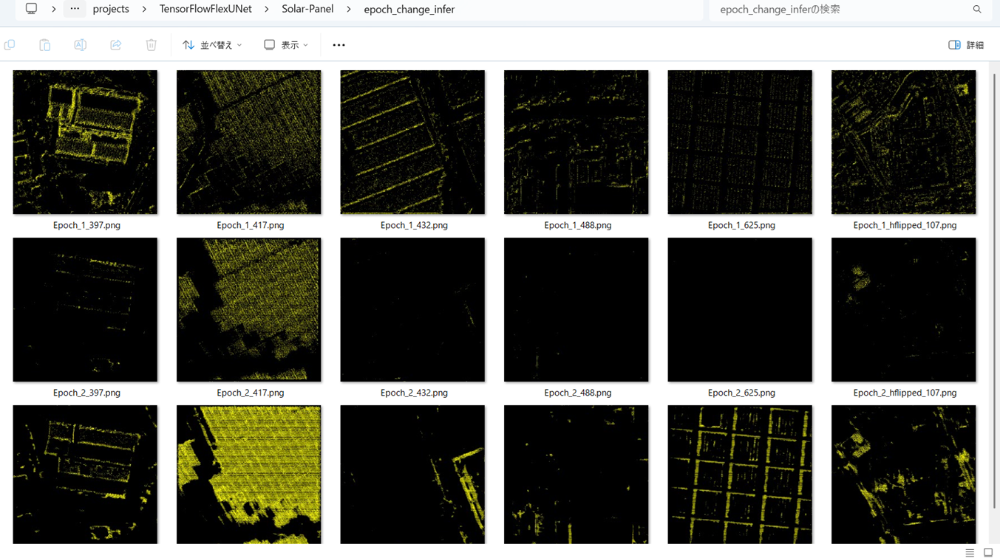 
 
<b>Epoch_change_inference output at middlepoint (epoch 20,21,22)</b> 
 
 

<b>Epoch_change_inference output at ending (epoch 40,41,42)</b> 
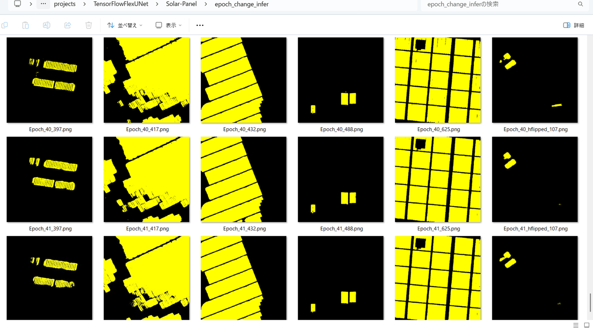 
 

In this experiment, the training process was stopped at epoch 42 by EarlyStoppingCallback.  
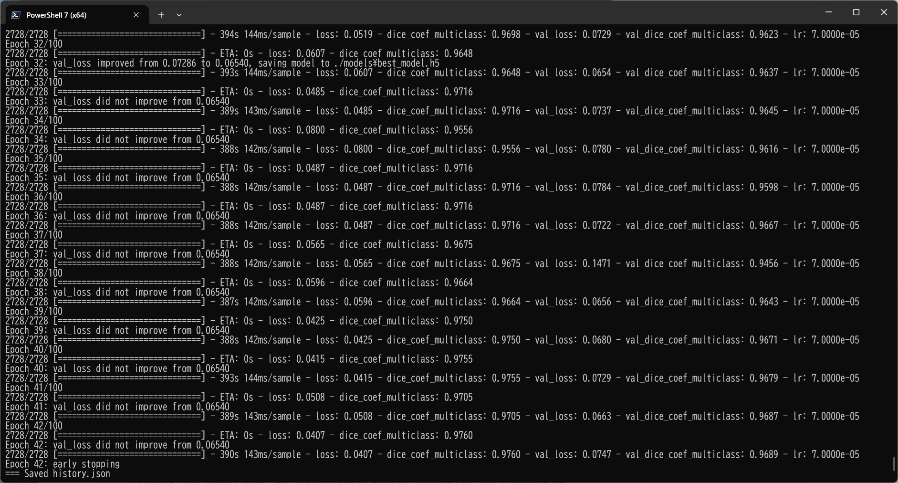 
 

<a href="./projects/TensorFlowFlexUNet/Solar-Panel/eval/train_metrics.csv">train_metrics.csv</a> 
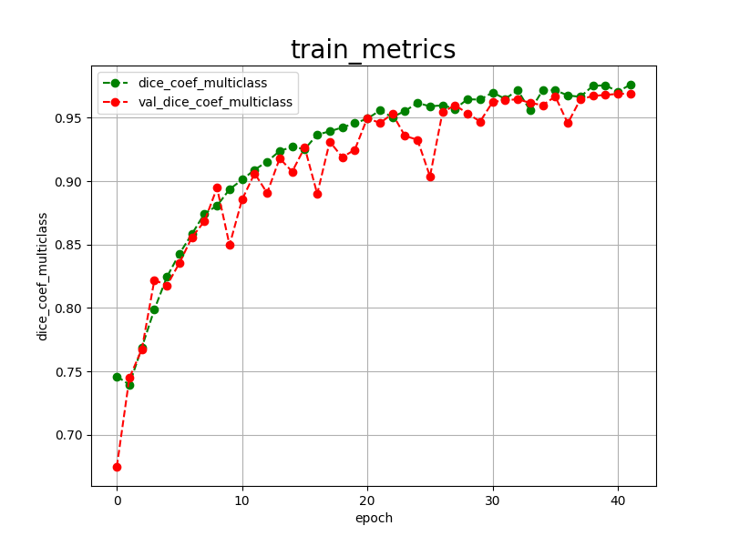 

 
<a href="./projects/TensorFlowFlexUNet/Solar-Panel/eval/train_losses.csv">train_losses.csv</a> 
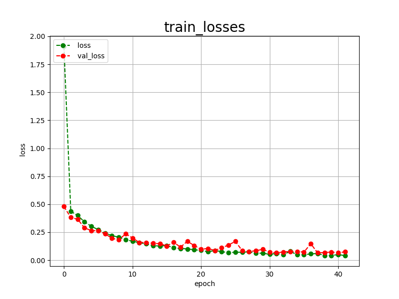 
 

<h3>
4 Evaluation
</h3>
Please move to a <b>./projects/TensorFlowFlexUNet/Solar-Panel</b> folder, 
and run the following bat file to evaluate TensorFlowUNet model for Solar-Panel. 
<pre>
./2.evaluate.bat
</pre>
This bat file simply runs the following command.
<pre>
python ../../../src/TensorFlowFlexUNetEvaluator.py ./train_eval_infer.config
</pre>

Evaluation console output: 
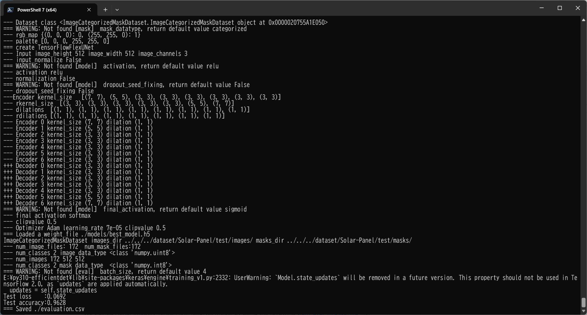
  Image-Segmentation-Solar-Panel

<a href="./projects/TensorFlowFlexUNet/Solar-Panel/evaluation.csv">evaluation.csv</a> 

The loss (categorical_crossentropy) to this Solar-Panel/test was not low, and dice_coef_multiclass not high as shown below.
 
<pre>
categorical_crossentropy,0.0692
dice_coef_multiclass,0.9628
</pre>
 
<h3>
5 Inference
</h3>
Please move to a <b>./projects/TensorFlowFlexUNet/Solar-Panel</b> folder 
,and run the following bat file to infer segmentation regions for images by the Trained-TensorFlowFlexUNet model for Solar-Panel. 
<pre>
./3.infer.bat
</pre>
This simply runs the following command.
<pre>
python ../../../src/TensorFlowFlexUNetInferencer.py ./train_eval_infer.config
</pre>

<b>mini_test_images</b> 
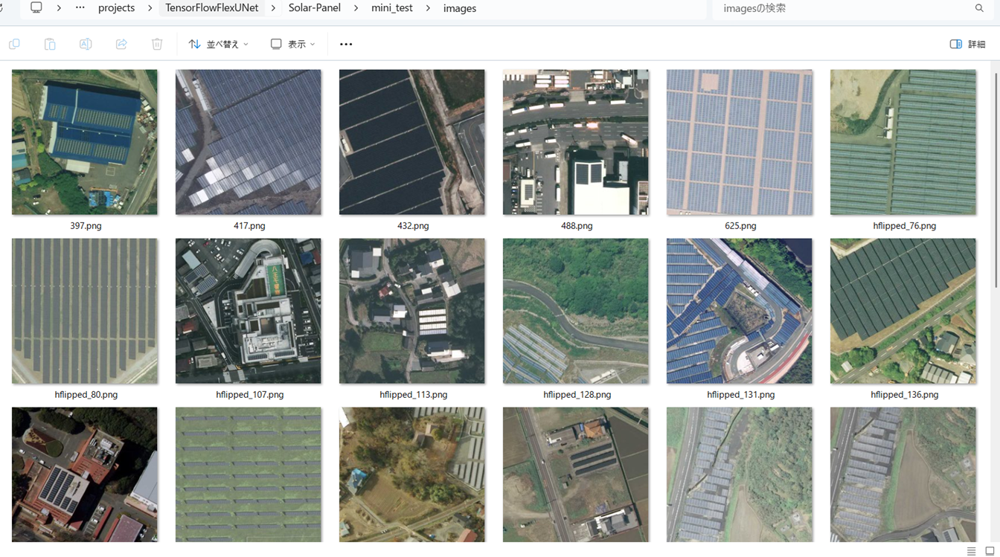 
<b>mini_test_mask(ground_truth)</b> 
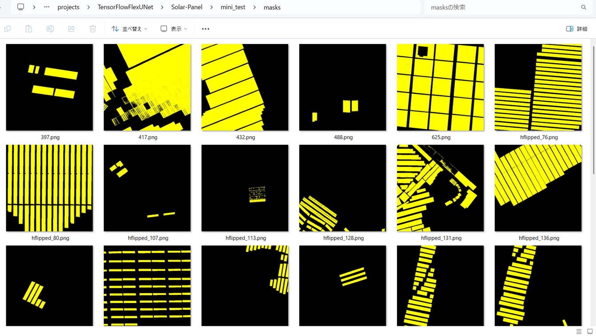 

<b>Inferred test masks</b> 
 
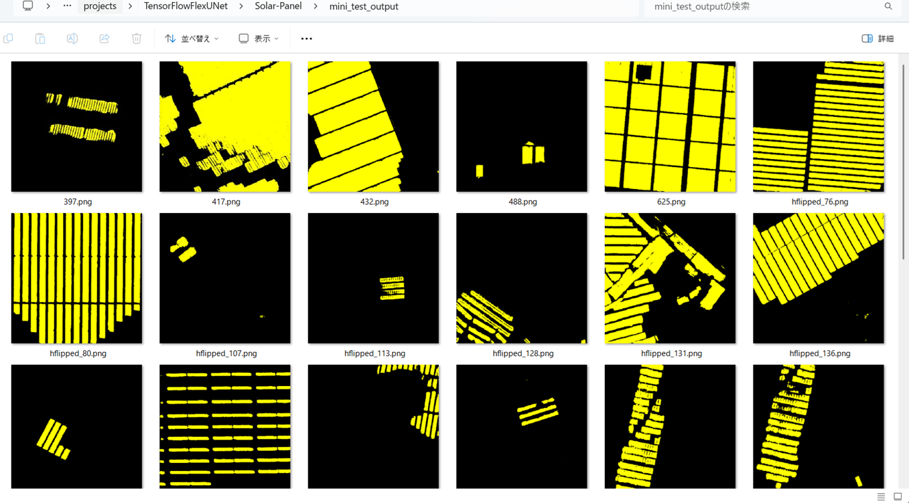 
 

<b>Enlarged images and masks for Images of  572 x 572 pixels </b> 
<table>
<tr>
<th>Image</th>
<th>Mask (ground_truth)</th>
<th>Inferred-mask</th>
</tr>

<td>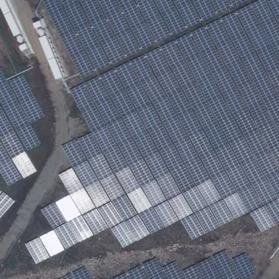</td>
<td>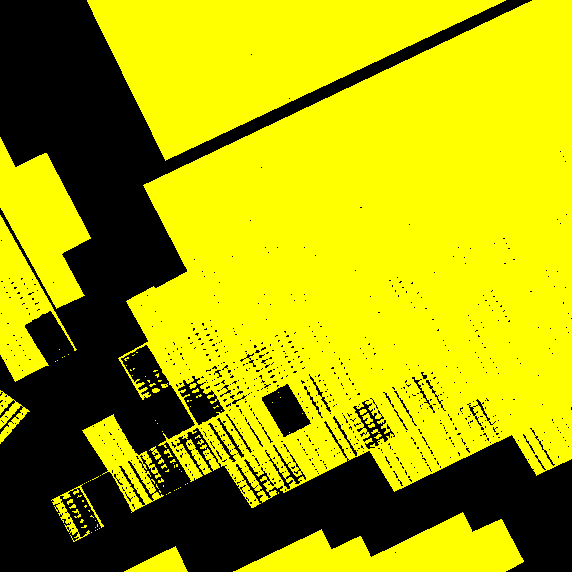</td>
<td>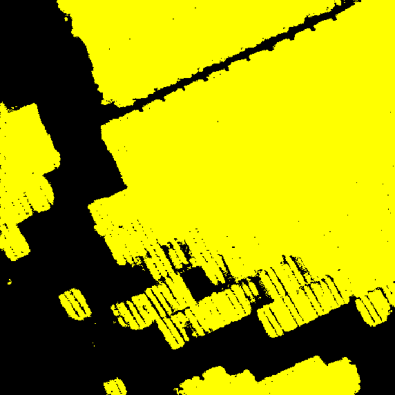</td>
</tr>
<tr>
<td>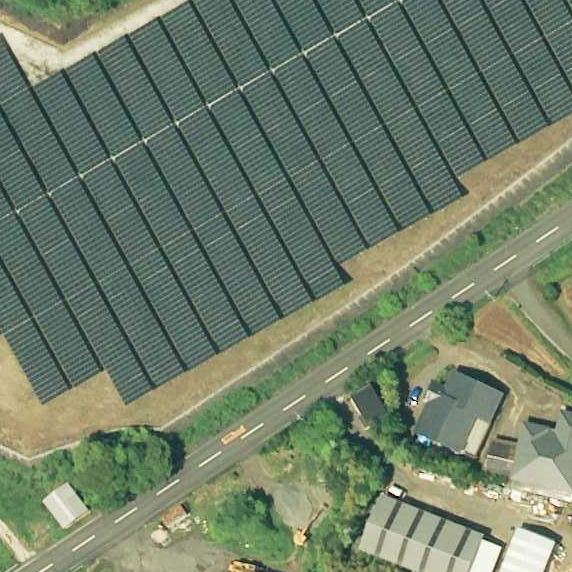</td>
<td>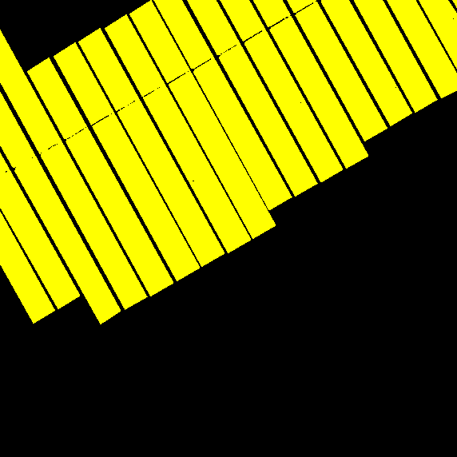</td>
<td>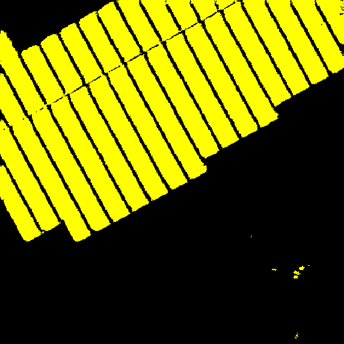</td>
</tr>
<tr>
<td></td>
<td></td>
<td></td>
</tr>

<tr>
<td>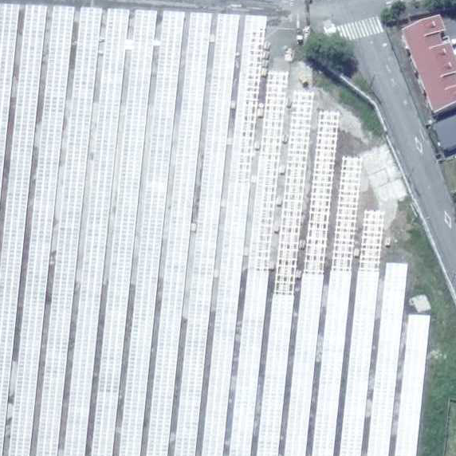</td>
<td>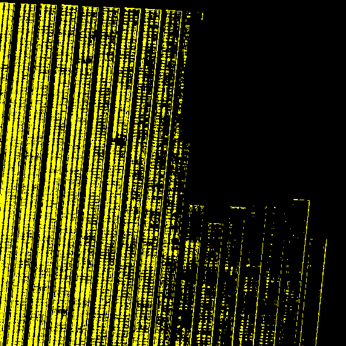</td>
<td>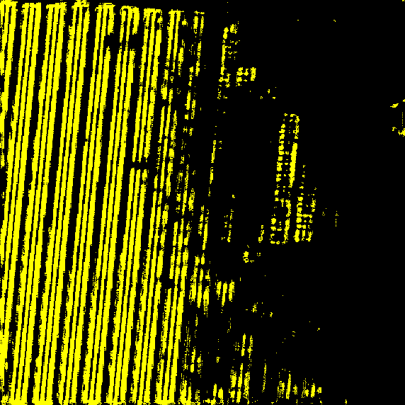</td>
</tr>
<tr>
<td>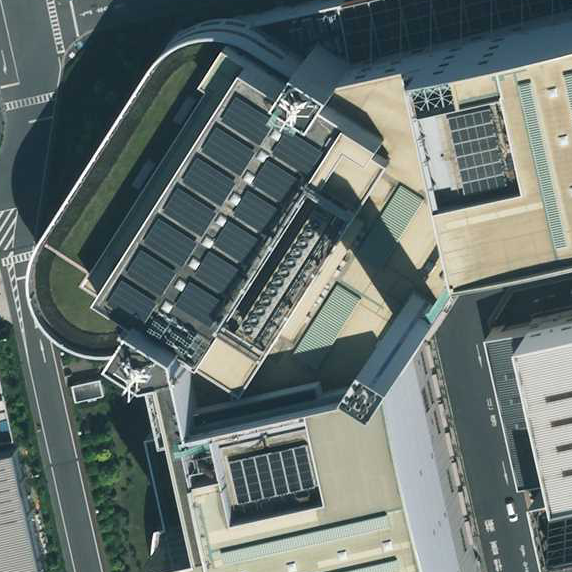</td>
<td>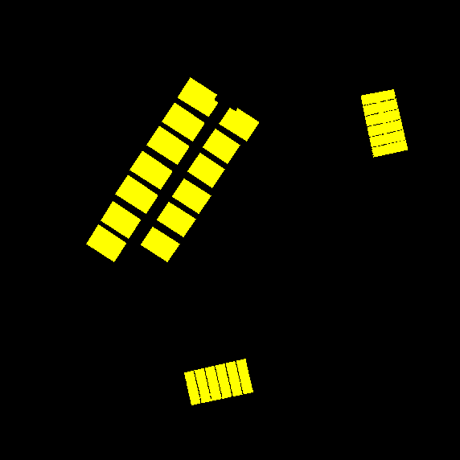</td>
<td>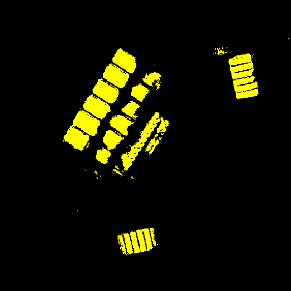</td>
</tr>
<tr>
<td></td>
<td></td>
<td></td>
</tr>

</table>

 

<h3>
References
</h3>
<b>1. TensorFlow-FlexUNet-Image-Segmentation-Model</b> 
Toshiyuki Arai antillia.com  
<a href="https://github.com/sarah-antillia/TensorFlow-FlexUNet-Image-Segmentation-Model">
https://github.com/sarah-antillia/TensorFlow-FlexUNet-Image-Segmentation-Model
</a>
 
 
<b>2. TensorFlow-FlexUNet-Image-Segmentation-Aerial-Imagery-Road</b> 
Toshiyuki Arai antillia.com  
<a href="https://github.com/atlan-antillia/TensorFlow-FlexUNet-Image-Segmentation-Aerial-Imagery-Road">
https://github.com/atlan-antillia/TensorFlow-FlexUNet-Image-Segmentation-Aerial-Imagery-Road
</a>
 
 

